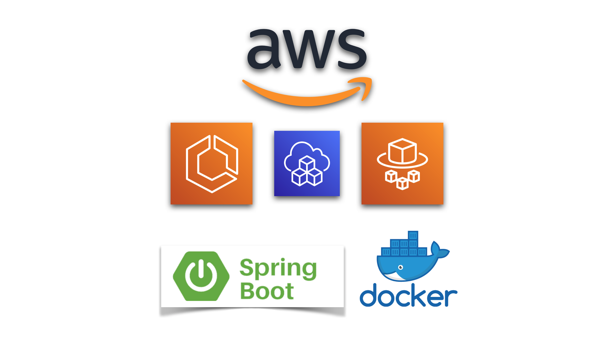

### I am Paulo Siécola 👋

Master of Science in Computer Science by São Paulo University - USP. Backend and mobile developer. Online instructor, author of books about cloud computing and mobile development. Professor in cloud computing.

<!--
**siecola/siecola** is a ✨ _special_ ✨ repository because its `README.md` (this file) appears on your GitHub profile.

Here are some ideas to get you started:

- 🔭 I’m currently working on ...
- 🌱 I’m currently learning ...
- 👯 I’m looking to collaborate on ...
- 🤔 I’m looking for help with ...
- 💬 Ask me about ...
- 📫 How to reach me: ...
- 😄 Pronouns: ...
- ⚡ Fun fact: ...
-->
