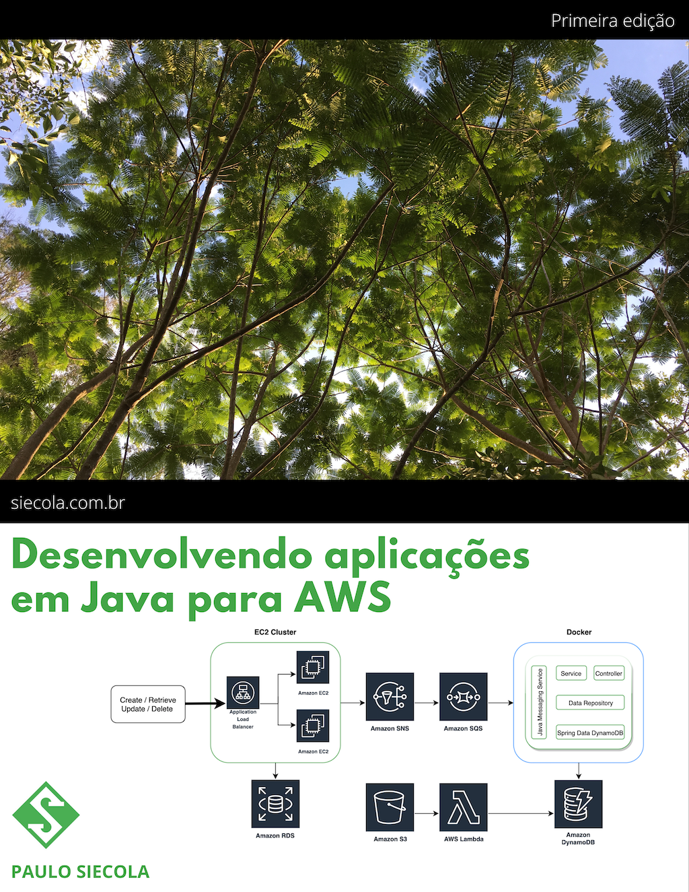
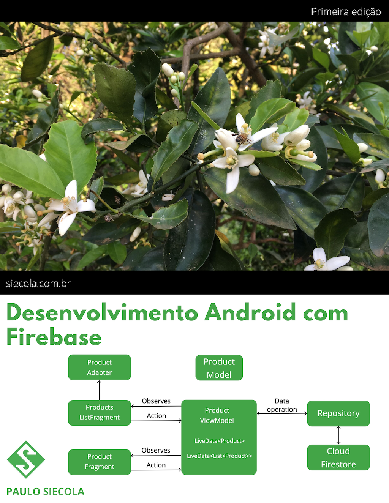
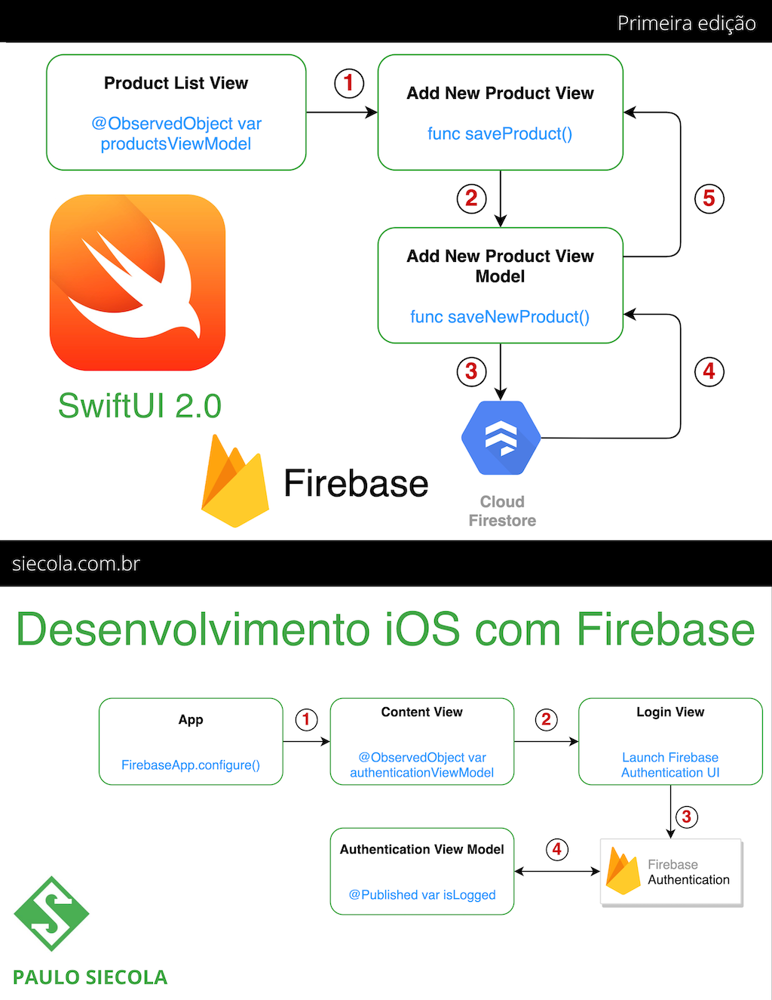

### Paulo Siécola

Mestre em Ciência da Computação pela Universidade de São Paulo - USP. Desenvolvedor backend e mobile. Instrutor online, professor e autor de livros sobre cloud computing e desenvolvimento mobile 

## Cursos online:

🔥[Criando serviços em Java com AWS ECS e Fargate](https://www.udemy.com/course/aws-ecs-fargate-java/?referralCode=859777729E4809B20485)🔥

Crie a infraestrutura das aplicações baseadas em **Docker** com **AWS CDK**, interagindo com serviços da AWS como **SNS**, **SQS**, **RDS**, **DynamoDB** e **S3**.

*Áudio em Português e legendas em Português e Espanhol*

Nesse curso você irá criar duas aplicações utilizando **[Spring Boot](https://spring.io/projects/spring-boot) em containers [Docker](https://www.docker.com)**, para interagir com serviços da AWS como:

- **[ECS](https://aws.amazon.com/ecs/):** o Elastic Container Service é o serviço de orquestração de containers da AWS. Com ele é possível gerenciar a execução de aplicações baseados em **containers Docker** de forma robusta e escalável. E com o **[AWS Fargate](https://aws.amazon.com/fargate)**, o **[Serverless](https://aws.amazon.com/serverless/)** compute for containers da AWS, não é necessário criar instâncias de máquinas EC2, reduzindo o custo de operação de aplicações baseadas em containers;
- **[RDS](https://aws.amazon.com/rds/)**: o Relational Database Service é um recurso que permite a criação de instâncias de banco de dados, com serviços como backups automáticos e diretrizes de segurança de acesso;

- **[SNS](https://aws.amazon.com/sns)**: o Simple Notification Service é um recurso muito utilizado para criação de mecanismos de notificações para diversas aplicações ou outros serviços;

- **[SQS](https://aws.amazon.com/sqs/)**: o Simple Queue Service é um recurso que permite a criação de filas para entrega de mensagens de forma rápida e confiável, possibilitando a criação de um mecanismo assíncrono de comunicação entre aplicações;

- **[DynamoDB](https://aws.amazon.com/dynamodb)**: esse é um poderoso serviço de banco de dados NoSQL, que permite a criação de tabelas, sem a necessidade de se criar um servidor, com características exclusão automática de dados, escalabilidade e muito mais;

- **[S3](https://aws.amazon.com/s3/)**: o Simple Storage Service permite a criação de buckets para armazenamento seguro de arquivos. Além disso é possível configurar eventos a serem gerados quando esses arquivos são colocados nesses buckets, fazendo com outras aplicações sejam avisadas desses eventos.

Com isso você aprenderá também a utilizar o **[AWS SDK](https://aws.amazon.com/sdk-for-java/)**, que é um conjunto de bibliotecas desenvolvido pela própria AWS para utilizar seus serviços. Esses recursos serão criados na AWS utilizando o **AWS Cloud Development Kit - [CDK](https://aws.amazon.com/cdk/)**, uma forma moderna de modelamento e provisionamento de infrastrutura na AWS. Você também aprenderá como monitorar os serviços através de gráficos e métricas, além de utilizar o **[CloudWatch Insights](https://docs.aws.amazon.com/pt_br/AmazonCloudWatch/latest/logs/AnalyzingLogData.html),** para visualização e pesquisa de logs das aplicações. Aprenda tudo isso com explicações detalhadas e exercícios práticos, onde você poderá testar suas habilidades e aplicar os conceitos aprendidos. Ao final desse curso, você estará confiante para arquitetar e desenvolver serviços na AWS de forma escalável e robusta.

------

## E-books:

👉 [Desenvolvendo aplicações em Java para AWS](https://leanpub.com/amazonwebservice)👈

Esse livro é destinado a **desenvolvedores de software**, com ou sem experiência em cloud computing, que desejam se aprofundar nos serviços oferecidos pela AWS. Também é uma fonte de conhecimento para **administradores e operadores de sistemas**, para se familiarizarem com as ferramentas de criação e administração de recursos de cloud computing da AWS. 

As aplicações ensinadas nesse livro, como forma de exemplificação dos conceitos que serão apresentados, utilizam *frameworks* e ferramentas modernas, como **Spring Boot** e **Docker**. Dessa forma, o leitor aprenderá a trabalhar com tais tecnologias em conjunto com os serviços de *cloud computing*. 

Durante o livro será utilizado o **[ECS](https://aws.amazon.com/ecs/)**, o Elastic Container Service é o serviço de orquestração de containers da AWS. Com ele é possível gerenciar a execução de aplicações baseados em **containers Docker** de forma robusta e escalável.

Todos os exemplos possuem código-fonte disponíveis para acesso gratuito. A seguir uma breve descrição de cada um deles:

- Project01: nesse exemplo será construída uma aplicação com serviços REST para cadastro de produtos de uma loja. Tais produtos serão armazenados em um banco de dados MySQL utilizando o [AWS RDS](https://aws.amazon.com/rds/). Em cada operação de cadastro, exclusão ou alteração de um produto, um evento será publicado em um tópico do [AWS SNS](https://aws.amazon.com/sns), permitindo a integração com outras aplicações. Essa aplicação também fará importação de arquivos de notas fiscais através do [AWS S3](https://aws.amazon.com/s3/).
- Project02: esse projeto contará com uma tabela do [AWS DynamoDB](https://aws.amazon.com/dynamodb), para armazenar os eventos gerados pela aplicação de cadastro de produtos, integrado através de uma fila do [AWS SQS](https://aws.amazon.com/sqs/).
- Lambda01: esse será um exemplo simples de uma aplicação *serverless* utilizando funções com o [AWS Lambda](https://aws.amazon.com/lambda/), demonstrando como agendar a execução de uma função.
- Lambda02: nesse segundo exemplo, será demonstrado como executar uma função Lambda através de um evento publicado no SNS.
- Lambda03: aqui será apresentado como criar uma função Lambda para consumir arquivos importados no S3 e gravar seus dados em uma tabela do DynamoDB.

------

👉 [Desenvolvimento Android com Firebase](https://leanpub.com/androidcloud)👈

O público alvo desse livro são desenvolvedores com conhecimento em programação orientada a objetos, que desejam conhecer e desenvolver aplicativos **[Android](https://developer.android.com)** utilizando serviços do **Google [Firebase](https://firebase.google.com)**.

Todos os aplicativos desenvolvidos aqui serão criados utilizando a linguagem **[Kotlin](https://kotlinlang.org)**, criada pela JetBrains. Ter conhecimento nessa linguagem é desejável, mas a estrutura didática do livro considera que o leitor não tem nenhuma experiência prévia. Por isso, alguns conceitos importantes sobre Kotlin serão apresentados ao longo do livro, principalmente aqueles mais utilizados para o desenvolvimento de aplicativos para Android.

Apesar desse livro ser voltado a conceitos e arquiteturas não triviais no âmbito do desenvolvimento de aplicativos para Android, ele não considera como requisito um conhecimento prévio do leitor nesse assunto.  O mesmo se aplica ao Google Firebase. Por isso, seu conteúdo passará por assuntos básicos até chegar ao seu propósito final.

 Os capítulos são apresentados da seguinte forma:

 O **capítulo 2** apresenta um pouco sobre o sistema operacional Android e o **capítulo 3** mostra conceitos por trás da plataforma Firebase que será utilizada pelos aplicativos desenvolvidos nesse livro.

 O **capítulo 4** instrui o leitor a preparar seu ambiente de desenvolvimento, no processo de instalação das ferramentas e bibliotecas necessárias, bem como suas configurações. 

 No **capítulo 5** são apresentados alguns conceitos da linguagem Kotlin, focado no que será utilizado para o desenvolvimentos dos aplicativos nesse livro.

 No **capítulo 6** começa o desenvolvimento de um aplicativo bem simples, somente com o intuito de demonstrar a ferramenta Android Studio, a linguagem Kotlin e a estrutura de um projeto inicial, utilizando `ConstraintLayout` para a construção da interface gráfica

 Ainda com o mesmo aplicativo desenvolvido, o **capítulo 7** apresenta alguns desafios do mundo de dispositivos móveis e como resolvê-los com técnicas simples. Aqui, serão apresentados conceitos como `Activity`, seu ciclo de vida e como lidar com seus estados.

 O **capítulo 8** inicia um novo aplicativo para consumir serviços REST com OAuth utilizando o framework **[Retrofit](https://square.github.io/retrofit/)**.

 O **capítulo 9** continua o segundo aplicativo, introduzindo conceitos de listas criadas com o componente `RecyclerView`, assim como a navegação entre telas utilizando o `NavigationController`, que permite a utilização de *safe args* entre fragmentos.

 No **capítulo 10** um novo aplicativo será criado para receber mensagens através do **[Firebase Cloud Messaging](https://firebase.google.com/docs/cloud-messaging)**, dando início a parte do livro que trata sobre a interação de aplicações Android com a plataforma Firebase.

 O **capítulo 11** inicia um novo aplicativo para utilizar o **[Firebase Authentication](https://firebase.google.com/docs/auth)**, para autenticação de usuários utilizando a conta do Google, sem a necessidade da criação de infraestruturas complexas. Ainda será apresentado como persistir dados no **[Firestore](https://firebase.google.com/docs/firestore)**, um banco de dados não-relacional hospedado no Firebase, que possibilita atualizações em tempo real.

 O **capítulo 12** utiliza uma ferramenta extremamente poderosa para o entendimento do comportamento do usuário com um aplicativo: **[Firebase Analytics](https://firebase.google.com/policies/analytics)**. Com ele é possível gerar eventos da utilização de cada parte da aplicação, concentrando em um dashboard analítico.

Finalmente o **capítulo 13** introduz o **[Firebase Remote Config](https://firebase.google.com/docs/remote-config)**, que possibilita a alteração de partes do aplicativo mediante variáveis de configuração que podem ser alteradas no console do Firebase.

------

👉 [Desenvolvimento iOS com Firebase](https://leanpub.com/ioscloud)👈

Crie aplicativos para iOS utilizando SwiftUI 2.0 e serviços do Firebase, como Authentication, Firestore, Remote Config e Storage.

 O público alvo desse livro são desenvolvedores com conhecimento em programação orientada a objetos, que desejam conhecer e desenvolver aplicativos para **[iOS](https://developer.apple.com/ios/)** utilizando serviços do **Google [Firebase](https://firebase.google.com)**.

 Todos os aplicativos desenvolvidos aqui serão criados utilizando a linguagem **[Swift](https://swift.org)**, criada pela Apple. Ter conhecimento nessa linguagem é desejável, mas a estrutura didática do livro considera que o leitor não tem nenhuma experiência prévia. Por isso, alguns conceitos importantes sobre Swift serão apresentados ao longo do livro, principalmente aqueles mais utilizados para o desenvolvimento de aplicativos para iOS.

 Apesar desse livro ser voltado a conceitos e arquiteturas não triviais no âmbito do desenvolvimento de aplicativos para iOS, ele não considera como requisito um conhecimento prévio do leitor nesse assunto.  O mesmo se aplica ao Google Firebase. Por isso, seu conteúdo passará por assuntos básicos até chegar ao seu propósito final.

 O **capítulo 2** oferece uma visão geral de como o processo de desenvolvimento de um app iOS acontece. 

 No **capítulo 3**, o leitor terá uma explicação inicial sobre os serviços do Firebase que serão utilizados nesse livro, para integrar nas aplicações a serem desenvolvidas para iOS.

 O **capítulo 4** é uma introdução a alguns conceitos da linguagem **Swift**, principalmente aqueles que serão mais utilizados nos exemplos que serão desenvolvidos nesse livro.

 No **capítulo 5** é criado o primeiro aplicativo, já utilizando **[SwiftUI](https://developer.apple.com/xcode/swiftui/)** e as facilidades do Xcode Preview. Também são introduzidos conceitos como `State` e `Binding`, que facilitam a atualização da interface gráfica através de eventos.

 O **capítulo 6** inicia um novo projeto onde são apresentadas técnicas modernas para a criação de um aplicativo para consumir **serviços REST autenticação OAuth** utilizando o **[Alamofire](https://github.com/Alamofire/Alamofire)**. Tudo construído com **SwiftUI**, mostrando o que ele tem de melhor, com a utilização de *viewModels* para a representação dos dados a serem atualizados na interface gráfica. Esse mesmo projeto será continuado no **capítulo 7**, onde será introduzida a navegação entre *view* dentro do app, assim como o consumo de outras operações do serviço REST.

 O **capítulo 8** apresenta como construir um app para se registrar e receber mensagens do **[Firebase Cloud Messaging](https://firebase.google.com/docs/cloud-messaging)**, um serviço capaz de enviar notificações a dispositivos móveis do Google.

 No **capítulo 9** será mostrado como autenticar usuários com o **[Firebase Authentication](https://firebase.google.com/docs/auth)** de forma fácil e descomplicada. 

 A informação do usuário autenticado será utilizada para definir as regras de segurança de acesso aos dados que ele criar no **[Firestore](https://firebase.google.com/docs/firestore)**, um banco de dados não-relacional com sincronismo *realtime*, como será visto no **capítulo 10**.

 No **capítulo 11** será visto outro serviço do Firebase, o **[Analytics](https://firebase.google.com/policies/analytics)**, capaz de coletar eventos das ações do usuário dentro app, para obtenção de dados sobre seu comportamento e utilização de funcionalidades.

O **capítulo 12** introduz o **[Firebase Remote Config](https://firebase.google.com/docs/remote-config)**, que possibilita a alteração de partes do aplicativo mediante variáveis de configuração que podem ser alteradas no console do Firebase.

Finalmente, no **capítulo 13** é apresentado o **[Firebase Storage](https://firebase.google.com/docs/storage)**, que permite o armazenamento de objetos e arquivos no Firebase, utilizando as mesmas regras de segurança de acesso adotadas no Firestore. Com isso o usuário pode guardar seus arquivos de forma segura.

 A implementação utilizando o SDK do Firebase faz com que o trabalho de upload e download das fotos seja bem simples e totalmente aderente à arquitetura adotada no restante das implementações realizadas nesse livro.